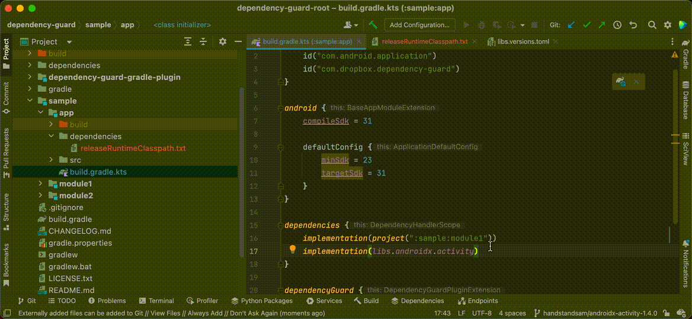
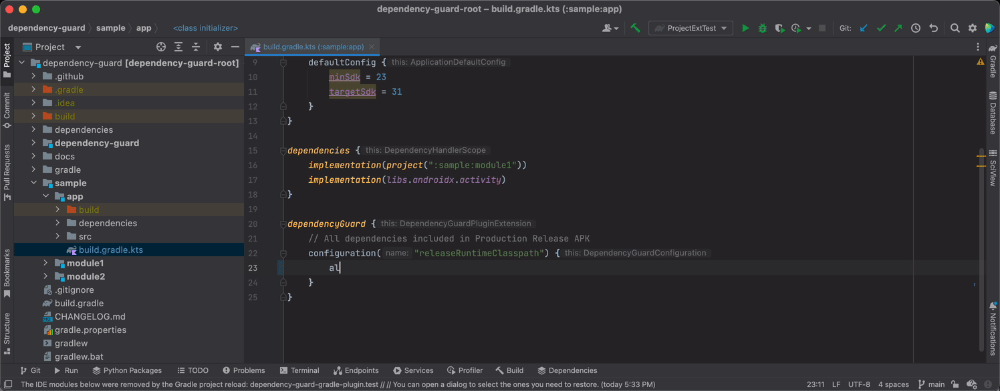
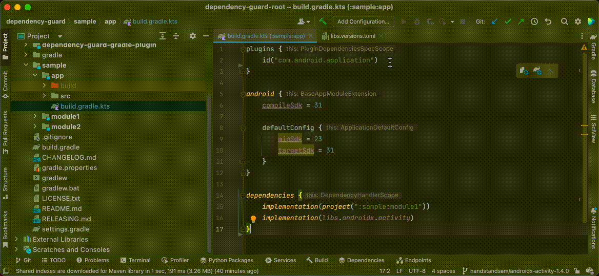
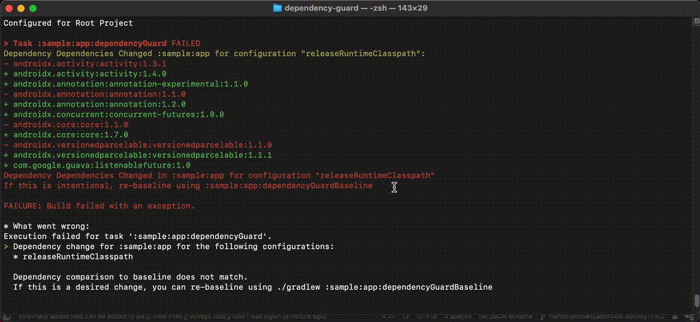
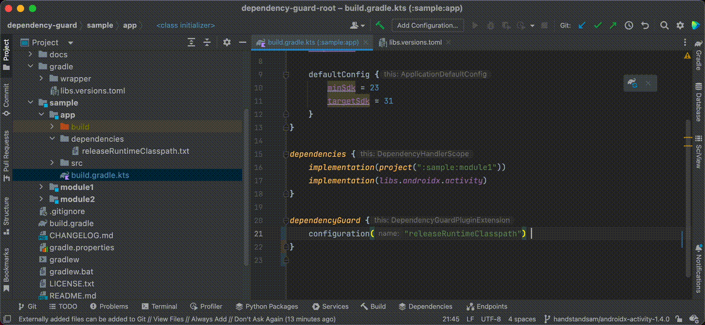
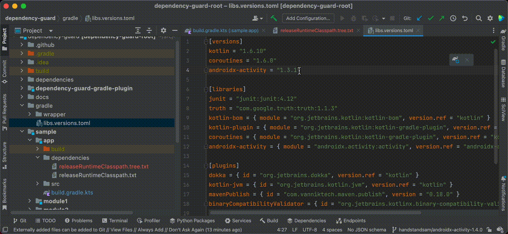
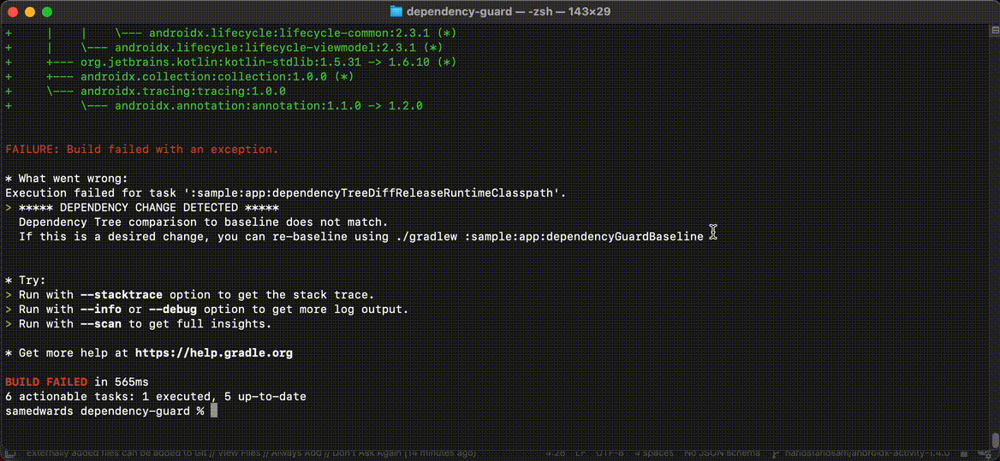

# 🛡️ Dependency Guard

A Gradle plugin that helps you **guard against unintentional dependency changes**.

## Surface Transitive Dependency Changes
Comparison to a baseline occurs whenever you run the `dependencyGuard` Gradle task.

A small single version bump of `androidx.activity` from `1.3.1` -> `1.4.0` causes many libraries to transitively update.



## Provide Custom Rules for Allowed Dependencies
For a given configuration, you may never want `junit` to be shipped.  You can prevent this by modifying the `allowRule` rule to return `!it.contains("junit")` for your situation.




## Why Was Dependency Guard Built?
As platform engineers, we do a lot of library upgrades, and needed insight into how dependencies were changing over time.  Any small change can have a large impact. On large teams, it's not possible to track all dependency changes in a practical way, so we needed tooling to help.  This is a tool that surfaces these changes to any engineer making dependency changes, and allows them to re-baseline if it's intentional.  This provides us with historical reference on when dependencies (including transitive) are changed for a given configuration.

### Goals:
- Surface transitive and non-transitive dependencies changes for our production build configurations.  This helps during version bumps and when new libraries are added.
- Provide the developer with the ability to easily accept changes as needed.
- Add deny-listing for production build configurations to explicitly block some dependencies from production.
- Include a record of the change in Git when their code is merged to easily diagnose/debug crashes in the future.
- Be deterministic.  De-duplicate entries, and order alphabetically.

## Real World Issues Which Dependency Guard Addresses
* Accidentally shipping a testing dependency to production because `implementation` was used instead of `testImplementation` - [@handstandsam](https://twitter.com/joreilly)
  * Dependency Guard has List and Tree baseline formats that can compared against to identify changes. If changes occur, and they are expected, you can re-baseline.
* Dependency versions were transitively upgraded which worked fine typically, but caused a runtime crash later that was hard to figure out why it happened.
  * You would see the diff off dependencies in Git since the last working version and be able to have quickly track down the issue.
* After adding `Ktor 2.0.0`, it transitively upgraded to `Kotlin 1.6.20` which caused incompatibilities with `Jetpack Compose 1.1.1` which requires `Kotlin 1.6.10` - [@joreilly](https://twitter.com/joreilly)
  * During large upgrades it is important to see how a single version bump will impact the rest of your application.
* Upgrading to the Android Gradle Plugin transitively downgraded protobuf plugin which caused issues - [@AutonomousApps](https://twitter.com/AutonomousApps)

# Setup and Configuration
## Step 1: Adding The Dependency Guard Gradle Plugin and Baselining
```kotlin
// sample/app/build.gradle.kts
plugins {
  id("com.dropbox.dependency-guard")
}
```

## Step 2: Run `./gradle dependencyGuard` and Configure
This will show a list of available configuration(s) for this Gradle module. 

You can choose the configurations you want to monitor.  

We suggest monitoring your release configuration to know what is included in production builds. You can choose to monitor any classpath configuration with Dependency Guard.

```kotlin
// sample/app/build.gradle.kts
dependencyGuard {
    // All dependencies included in Production Release APK
    configuration("releaseRuntimeClasspath") 
}
```
NOTE: Checkout the "[Adding to the Buildscript Classpath](#adding-to-the-buildscript-classpath)" section below if the plugin can't be resolved.




## Step 3: Run `./gradlew dependencyGuard` to Detect Changes

It's suggested to run in your CI or pre-commit hooks to detect these changes.  If this task is not run, then you aren't getting the full benefit of this plugin.

Bump Version and Detect Change


## Step 4: Rebaselining to Accept Changes

If any dependencies have changed, you will be provided with the `./gradlew dependencyGuardBaseline` task to update the baseline and intentionally accept these new changes.

Rebaseline to Accept Change


# Additional Configuration Options

## Allow Rules for Dependencies (Optional)

If you have explicit test or debugging dependencies you never want to ship, you can create rules for them here.

```kotlin
dependencyGuard {
    configuration("releaseRuntimeClasspath") {
        allowRule = {
            // Disallow dependencies with a name containing "junit"
            !it.contains("junit")
        }
    }
}
```


## Configuring Your Dependency Baseline (Optional)
By default, Dependency Guard tracks modules and artifacts in a list format is generated at `dependencies/${configurationName}.txt`.
```
:sample:module1
:sample:module2
org.jetbrains.kotlin:kotlin-stdlib-common:1.6.10
org.jetbrains.kotlin:kotlin-stdlib-jdk7:1.6.10
org.jetbrains.kotlin:kotlin-stdlib-jdk8:1.6.10
org.jetbrains.kotlin:kotlin-stdlib:1.6.10
org.jetbrains.kotlinx:kotlinx-coroutines-core-jvm:1.5.2
org.jetbrains.kotlinx:kotlinx-coroutines-core:1.5.2
org.jetbrains:annotations:13.0
```

You can customize choose to not track modules or artifacts:
```kotlin
dependencyGuard {
  configuration("releaseRuntimeClasspath") {
    // What is included in the list report
    modules = true // Defaults to true
    artifacts = true // Defaults to true
  }
}
```

## Tree Format (Optional)

The builtin Dependencies task from Gradle is `:dependencies`.  The tree format support for Dependency Guard leverages this under the hood and targets it for a specific configuration.

The [`dependency-tree-diff` library](https://github.com/JakeWharton/dependency-tree-diff) in extremely helpful tool, but is impractical for many projects in Continuous Integration since it has a lot of custom setup to enable it. ([related discussion](https://github.com/JakeWharton/dependency-tree-diff/discussions/8)).  `dependency-tree-diff`'s diffing logic is actually used by Dependency Guard to highlight changes in trees.

The tree format proved to be very helpful, but as we looked at it from a daily usage standpoint, we found that the tree format created more noise than signal.  It's super helpful to use for development, but we wouldn't recommend storing the tree format in Git, especially in large projects as it gets noisy, and it becomes ignored.  In brainstorming with [@joshfein](https://twitter.com/joshfein), it seemed like a simple orded, de-duplicated list of dependencies were better for storing in CI.

`dependencies/releaseRuntimeClasspath.tree.txt`
```

------------------------------------------------------------
Project ':sample:app'
------------------------------------------------------------

releaseRuntimeClasspath - Resolved configuration for runtime for variant: release
\--- project :sample:module1
     +--- org.jetbrains.kotlin:kotlin-stdlib-jdk8:1.6.10
     |    +--- org.jetbrains.kotlin:kotlin-stdlib:1.6.10
     |    |    +--- org.jetbrains:annotations:13.0
     |    |    \--- org.jetbrains.kotlin:kotlin-stdlib-common:1.6.10
     |    \--- org.jetbrains.kotlin:kotlin-stdlib-jdk7:1.6.10
     |         \--- org.jetbrains.kotlin:kotlin-stdlib:1.6.10 (*)
     \--- project :sample:module2
          +--- org.jetbrains.kotlin:kotlin-stdlib-jdk8:1.6.10 (*)
          \--- org.jetbrains.kotlinx:kotlinx-coroutines-core:1.5.2
               \--- org.jetbrains.kotlinx:kotlinx-coroutines-core-jvm:1.5.2
                    +--- org.jetbrains.kotlin:kotlin-stdlib-jdk8:1.5.30 -> 1.6.10 (*)
                    \--- org.jetbrains.kotlin:kotlin-stdlib-common:1.5.30 -> 1.6.10

(*) - dependencies omitted (listed previously)

A web-based, searchable dependency report is available by adding the --scan option.

```

### Enabling Tree Format
Enable the tree format for a configuration with the following option:
```kotlin
dependencyGuard {
  configuration("releaseRuntimeClasspath") {
    tree = true // Enable Tree Format
  }
}
```
### Creating a Tree Format Baseline


### Detecting Changes in Tree Format


### Rebaselining Tree Format



# Additional Information

### Which Configurations Should be Guarded?
* Production App Configurations (what you ship)
* Production Build Configurations (what you use to build your app)

Changes to either one of these can change your resulting application.

### How Does Dependency Guard Work?

Dependency Guard writes a baseline file containing all your transtitive dependencies for a given configuration that should be checked into git.

Under the hood, we're leveraging the same logic that [the Gradle `dependencies` task](https://docs.gradle.org/current/userguide/viewing_debugging_dependencies.html) uses and displays in build scans, but creating a process which can guard against changes.

A baseline file is created for each build configuration you want to guard.

If the dependencies do change, you'll get easy to read warnings to help you visualize the differences, and accept them by re-baselining.  This new baseline will be visible in your Git history to help understand when dependencies changed (including transitive).


## Full Configuration Options

```kotlin
dependencyGuard {
  configuration("releaseRuntimeClasspath") {
    // What is included in the list report
    modules = true // Defaults to true
    artifacts = true // Defaults to true

    // Tree Report
    tree = false // Defaults to false

    // Filter through dependencies
    allowRule = {dependencyName: String ->
        return true // Defaults to true
    }
  }
}
```

## Suggested Workflows

The Dependency Guard plugin adds a few tasks for you to use in your Gradle Builds.  Your continuous integration environment would run the `dependencyGuard` task to ensure things did not change, and require developers to re-baseline using the `dependencyGuardBaseline` tasks when changes were intentional.

# Gradle Tasks added by Dependency Guard

### `dependencyGuard`

Compare against the configured transitive dependency report baselines, or generate them if they don't exist.

This task is added to any project that you apply the plugin to.  The plugin should only be applied to project you are interested in tracking transtive dependencies for.

### `dependencyGuardBaseline`

This task overwrites the dependencies in the `dependency-guard` directory in your module.

## Baseline Files

Baseline files are created in the "dependency-guard" folder in your module.  The following reports are created for the `:sample:app` module by running `./gradlew :sample:app:dependencyGuardBaseline`

## Adding to the Buildscript Classpath

Snapshot versions are under development and change, but can be used by adding in the snapshot repository
```groovy
// Root build.gradle
buildscript {
    repositories {
        mavenCentral()
        google()
        gradlePluginPortal()
        // SNAPSHOT Versions of Dependency Guard
        maven { url "https://s01.oss.sonatype.org/content/repositories/snapshots" }
    }
    dependencies {
        classpath("com.dropbox.dependency-guard:dependency-guard:0.1.0")
    }
}
```

## License

    Copyright (c) 2022 Dropbox, Inc.

    Licensed under the Apache License, Version 2.0 (the "License");
    you may not use this file except in compliance with the License.
    You may obtain a copy of the License at

        http://www.apache.org/licenses/LICENSE-2.0

    Unless required by applicable law or agreed to in writing, software
    distributed under the License is distributed on an "AS IS" BASIS,
    WITHOUT WARRANTIES OR CONDITIONS OF ANY KIND, either express or implied.
    See the License for the specific language governing permissions and
    limitations under the License.


